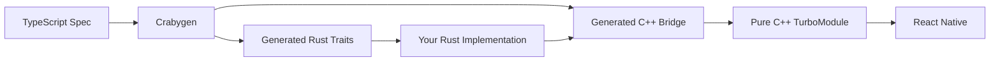

# Introduction

## What is Craby?

**Craby** is a type-safe Rust development tool for React Native that bridges the gap between JavaScript and native code. It automatically generates Rust and C++ code based on TypeScript NativeModule schemas and integrates with **pure C++ TurboModule**—no platform-specific interop like `ObjCTurboModule` or `JavaTurboModule` required.

## Why Craby?

### The Problem

Developing React Native native modules traditionally involves:

- Writing boilerplate code in multiple languages (TypeScript, C++, Objective-C, Java)
- Maintaining type safety manually across language boundaries
- Dealing with platform-specific code and interop layers
- Complex setup and configuration for native builds

### The Solution

Craby solves these problems by:

1. **Auto Code Generation**: Define your API once in TypeScript, and Craby generates all the necessary Rust and C++ bridging code
2. **Type Safety**: Compile-time type checking across TypeScript, Rust, and C++ prevents runtime errors
3. **Pure C++ Integration**: Direct integration with C++ TurboModule bypasses platform-specific layers for maximum performance
4. **Simple Development**: Focus on implementing your business logic in Rust—Craby handles the rest

## How It Works



1. **Define**: Write your module specification in TypeScript using the TurboModule interface
2. **Generate**: Run `crabygen` to automatically generate Rust traits and C++ bridging code
3. **Implement**: Implement the generated Rust trait with your business logic
4. **Build**: Run `craby build` to compile everything into native binaries for iOS and Android

## Key Features

### Blazing Fast Performance

Craby achieves superior performance through:
- **Pure C++ Integration**: Direct integration with C++ TurboModule bypasses platform-specific layers (`ObjCTurboModule`, `JavaTurboModule`)
- **Zero-Cost FFI**: Rust-to-C++ communication via [cxx](https://cxx.rs/) ensures zero-overhead interop with compile-time safety
- **Template-Based Types**: User-defined types are processed at compile-time using C++ templates, eliminating runtime type conversion overhead

### Automatic Code Generation

Never write boilerplate again. Craby analyzes your TypeScript specs and generates:
- Rust trait definitions
- C++ bridging implementations
- FFI layer code
- Native build configurations (CMake, XCFramework)

### Type Safety

Craby ensures type consistency across the entire stack:
- TypeScript types → Rust types → C++ types
- Compile-time validation prevents mismatched types
- Rich type support including objects, arrays, enums, promises, and nullable types

### Simple Integration

With Craby, you focus on what matters—your implementation:

```rust
impl CalculatorSpec for Calculator {
    fn add(&self, a: Number, b: Number) -> Number {
        a + b  // Just implement your logic!
    }
}
```

### Rich Type Support

Craby supports all common types:
- **Primitives**: `number`, `string`, `boolean`
- **Collections**: Arrays and objects
- **Enums**: Both string and numeric enums
- **Async**: Promise-based APIs
- **Nullable**: Optional types with `null` support
- **Signals**: Event emitters for native-to-JS communication

## When to Use Craby

Craby is ideal for:

- ✅ Building high-performance native modules in Rust
- ✅ Projects requiring complex data processing on native side
- ✅ Applications needing secure, type-safe native code
- ✅ Teams wanting to leverage Rust's safety and performance in React Native

Craby might not be the best fit for:

- ❌ Simple native modules with minimal logic (native JS modules may suffice)
- ❌ Projects that can't include Rust toolchain in their build process
- ❌ Modules requiring platform-specific APIs (use platform-specific modules instead)

## Next Steps

Ready to get started? Head over to the [Getting Started](/guide/getting-started) guide to create your first Craby module!
